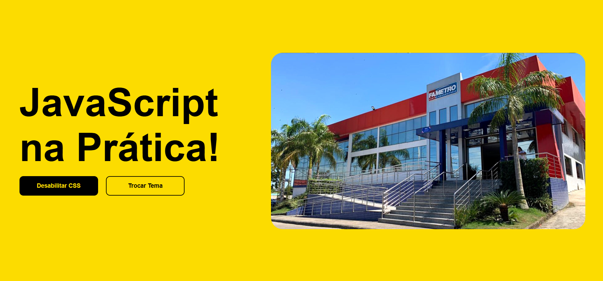

## 📖 Trabalho de Faculdade

**`O que é?`**

Este site é um trabalho prático que será apresentado em sala de aula para meus colegas, com o objetivo de ensinar como o JavaScript pode tornar uma página web dinâmica, modificando-a através do DOM. Aqui, demonstro funções básicas como troca de temas, desativação do CSS e rotação de imagens utilizando apenas as ferramentas nativas do JavaScript.

#

### 📲 Interface

**`Inicio`**

Inicialmente, é uma página simples com um fundo azul, dois botões e uma imagem. A orientação dela no computador é horizontal e podendo se ajustar de acordo com o tamanho da tela do dispositivo que está sendo utilizado.

**`Tema Amarelo`**

Quando o botão 'Trocar Tema' é clicado, as cores dos componentes da página mudam automaticamente para um esquema de cores diferente, podendo alternar entre vários temas a cada novo clique.

#

### 🙋‍♂️Pessoas Envolvidas

**`Grupo`**

A ideia do trabalho foi sugerida por [Alexandre Dias](https://github.com/Alexandrediasss), Fernando da Costa e Renison Carlos. Agradecemos por ter lida até aqui! 👍

#